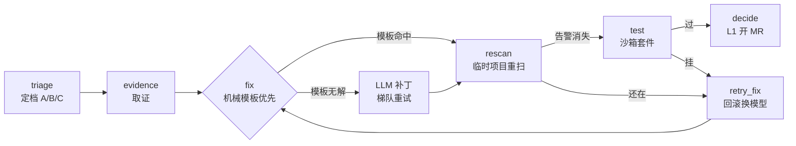

# ClearDebt

Sonar 告警自动清偿 Agent：读 Sonar 告警 → 自备大模型交补丁 → Sonar 重扫 + 沙箱测试双闸验证 → 在 GitLab / GitHub / Azure DevOps 开修复请求。人只在托管平台上审，Agent 不自动合并。

支持语言：JavaScript / TypeScript、Python、Java、C#；另含密钥类告警与 SCA 依赖升版本。

## 架构：状态机，不是调包



要点：

- **不信任模型输出**：L1 必须同时满足“Sonar 重扫告警消失 + 测试闸通过”，缺一不可
- **防作弊**：NOSONAR 抑制注释、删代码消告警会被 anti-cheat 节点判 L3（评测里真抓到过现行）
- **断点续跑**：Postgres checkpoint 按指纹存状态，中断后 resume 不重跑
- **机械优先**：8 条确定性规则（删 import、死存储、自赋值…）走 tree-sitter 模板，零模型调用；模板无解自动降级 LLM
- **规则实时化**：4446 条规则从 Sonar API 拉取自动分级，人工精选进库可在线改，控制台规则管理页即时生效

## 评测：OSS 真实异味集

`bench/oss_smell_v1.json`——dayjs + axios 冻结 SHA（`436bde0`/`5fc40e1`），fresh run（开跑前清 checkpoint，无重放），环境误杀不计分母：

| 仓库 | 判分口径 | 条数 | L1 | L1 率 |
|---|---|---|---|---|
| dayjs | 重扫 + 测试双闸 | 30 | 16 | 53% |
| axios | 重扫闸（套件需外网，测试闸跳过并审计） | 29 | 18 | 62% |
| 合计 | — | 59 | 34 | 58% |

诚实声明：n=59（60 条里 1 条只拿到环境误杀结果，未计分），选样按规则轮采（非随机）；模型 DeepSeek；基线锁版本可当回归集（`bench/run_oss_bench.py`）。玩具仓历史：27 条 L1 67%。

## 启动

需要本机有 Docker、Git、Node，以及 Python 3.12。

```bash
python3.12 scripts/up.py
```

看到「审核页：http://127.0.0.1:8000/」就打开这个地址。没填接入信息之前，服务碰不到任何仓库。更细的步骤见 `启动说明.md`，能力对齐清单见 `技术方案.md`。

## 接入

在审核页填写：

1. **Sonar** 地址与令牌  
2. **代码托管**令牌（GitLab / GitHub / Azure DevOps 按需；公开仓可免令牌，匿名拉取、扫描和查看问题，不能指派修复）
3. **绑定**：每个 Sonar 项目一行，写成 `项目key https://托管地址`（按 URL 识别平台）  
4. **大模型**：审核页填密钥，或设 `CLEARDEBT_LLM_API_KEY` / `deploy/llm/.token`。模型只交 `old_string` / `new_string`，过不过由重扫与测试决定  

可选：`CLEARDEBT_LLM_MODELS` / `CLEARDEBT_LLM_UPGRADE_MODEL`（失败升级重试）；管理页按项目开关 Backlog / 请求修复 / 覆盖日程，以及定时清 backlog 日程。

## 三种用法

- **手动指派**：审核页列出告警 → 勾选 →「指派给 Agent」  
- **定时 backlog**：打开日程后由工人按点跑白名单项目  
- **请求修复**：质量门失败的合并/拉取请求下留言或点「运行修复 Agent」；过闸后开出的修复请求打向**原源分支**  

先开「空跑」确认清算单，再关空跑真正开请求。

```bash
.venv/bin/python scripts/run_batch.py
```

## 实战故事（STAR）

三个都是生产环境真坑，定位链条完整：

**1. OOM 连环杀人案**——现象：Sonar 一天挂 6 次，指派/评测批量 L3。定位：退出码 0 极具迷惑性，查 `OOMKilled` 标志实锤内存杀手，Docker 虚拟机 7.75G 被 19 个容器 + 双路 scanner 吃光。解决：scanner 容器限 CPU/内存、bench 降单路、scan 链路加 `ensure_sonar` 自愈（挂了自动 `docker start` 等就绪）。固化：资源上限全部环境变量化。

**2. Checkpoint 重放污染评测**——现象：axios 8 条 0 秒“测试没通过”，跳闸开关明明开着。定位：LangGraph 按指纹存状态，同一 issue 第二次跑 resume 旧结果而非重跑，一次删出 670 行旧状态实锤。解决：bench 开跑前整表清状态。固化：`--fresh` 开关进回归脚本，评测五戒之一。

**3. 1G 内存勒死扫描器**——现象：重扫 `EXECUTION FAILURE` 且无 ERROR 日志。定位：三遍对照实验（限 1G 挂、不限制过、限 CPU+2G 过），embedded Node 在 arm64 转译下内存超线。解决：默认 2G+1 核，环境变量可调。教训：资源上限必须实测，不能拍脑袋。

## 许可证

AGPL-3.0。`LICENSE`（英文）与 `许可证（中文）` 为同一许可证的中英文表述。如有冲突，以英文为准。
