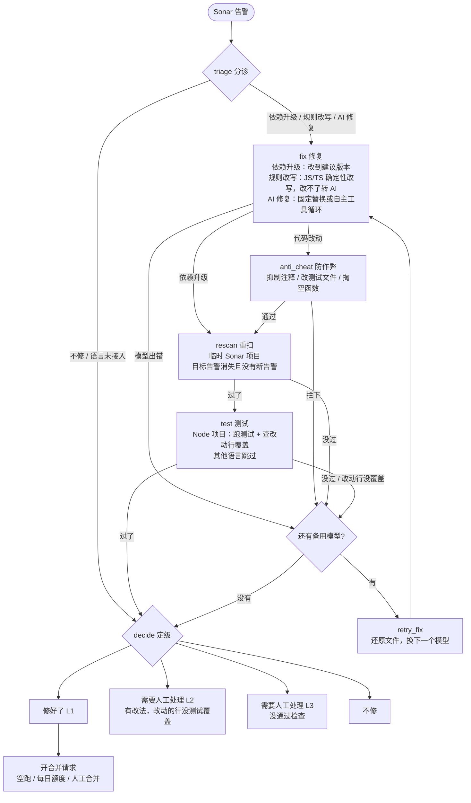

# ClearDebt

Sonar 告警自动清偿 Agent：读 Sonar 告警 → 模型取证并交补丁 → Sonar 重扫 + 沙箱测试验证 → 在 GitLab / GitHub / Azure DevOps 开修复请求。人只在托管平台上审，Agent 不自动合并。

支持语言：JavaScript / TypeScript、Python、Java、C#；另含密钥类告警与 SCA 依赖升版本。

## 架构：状态机，不是调包



要点：

- **不信任模型输出**：L1 必须同时满足“Sonar 重扫告警消失 + 测试闸通过”，缺一不可
- **防作弊**：NOSONAR 抑制注释、删代码消告警会被 anti-cheat 节点判 L3（评测里真抓到过现行）
- **断点续跑**：Postgres checkpoint 按指纹存状态，中断后 resume 不重跑
- **分诊五档**：依赖升级 / 规则改写 / AI 修复 / 不修 / 语言未接入（旧记录里的 A/B/C 会自动换成新名字）
- **规则改写优先**：8 个规则编号（删 import、死存储、自赋值…）在 JS/TS 上共 15 条规则，走 tree-sitter 确定性改写，零模型调用；改不了自动转 AI。其他语言直接走 AI
- **重试**：只有配置了备用模型（`CLEARDEBT_LLM_UPGRADE_MODEL` 或 `CLEARDEBT_LLM_MODELS`）才会失败后换模型重试；默认只有一个模型，不重试
- **自主模式**：按项目开启后，AI 修复可调用仓库与检查工具，在反馈后继续调查和改动；次数与时间有上限，最终等级仍由检查结果决定
- **规则元数据**：从 Sonar API 拉取规则名称、严重度和影响供展示；可修资格按完整规则键查 AI CodeFix 清单（默认用仓库内置快照），`secrets:*` 密钥规则始终可修

### 与 Sonar AI CodeFix 名单对齐

默认使用仓库内置的 Sonar AI CodeFix 适用规则快照 [`data/public_fix_lists/sonar_ai_codefix-2026-09-26.json`](data/public_fix_lists/sonar_ai_codefix-2026-09-26.json)（2635 条规则键）：Sonar 扫描命中清单里的规则，这条告警就可以指派给 Agent。清单只按完整规则键匹配；Agent 当前只接入 JavaScript、TypeScript、Python、Java 和 C#，其余语言的清单规则显示为「语言未接入」。Sonar 的 `secrets:*` 密钥规则不在清单里，但始终可修。SCA 依赖升级是独立工作流，不属于清单。

设置 `CLEARDEBT_AI_CODEFIX_RULES_FILE` 可换一份清单：同格式的 JSON 快照，或每行一个完整规则键（如 `javascript:S6582`）的 UTF-8 文本，允许空行和 `#` 注释。修改文件后无需重启；格式错误或文件不可读会报错。把它设为空字符串会关闭清单，改为只放行 Sonar 扫描结果里 `quickFixAvailable=true` 的具体告警。

公开竞品的自动修复资格快照和各自编号体系见 [data/public_fix_lists/README.md](data/public_fix_lists/README.md)。这些快照用于对照研究，不会把 CodeQL、CWE 或其他工具的编号误当成 Sonar 规则键。

控制台的「Agent可修规则清单」页面列出清单里 Agent 已接入语言的规则（加上密钥规则），只列规则键、名称和语言，不统计告警数。

## 评测：自主 Agent 对照

**评测集**：120 条冻结用例（[`bench/oss_smell_cases_v2.json`](bench/oss_smell_cases_v2.json)），覆盖 47 种规则类型，来自 dayjs 与 axios 的固定 SHA（`436bde0`、`5fc40e1`）。用同一条告警分别运行固定 AI 修复和自主工具循环，每一臂使用独立的新 checkpoint；仅统计仓库版本、检查闸门和执行模式均匹配的成对结果。脚本只调用单告警执行器，不会创建修复请求。

```bash
# 验证评测集
.venv/bin/python bench/validate_cases.py

# 运行评测（建议从小批量开始）
.venv/bin/python bench/run_autonomous_compare.py --per-project 10

# 重新生成或扩展评测集
.venv/bin/python bench/generate_cases.py --target 150 --per-rule-max 6
```

**评测指标**：修复成功率（重扫通过）、编译和测试通过率、新问题引入率、单次修复成本（token）和耗时。详细说明见 [bench/README.md](bench/README.md)。

dayjs 运行 Sonar 重扫、测试和覆盖率检查。axios 的测试需要外部服务，两臂均跳过测试并在结果中标记。脚本把逐条结果和汇总写入 `var/bench/`；样本少时只作为链路验证，不据此声称总体成功率。

**历史评测**：2026-09-27 的 v5 成对评测预定 30 条、有效 27 条：自主 Agent L1 24 条，固定流程 L1 22 条。dayjs 的 14 条有效配对跑完整测试闸；axios 的 13 条仅跑 Sonar 闸。逐条数据、排除原因、耗时和限制见 [自主 Agent v5 评测报告](bench/autonomous_v5_report_2026-09-27.md)。早期 4 条链路试跑见 [v4 记录](bench/autonomous_pilot_2026-09-27.md)，不与 v5 汇总。旧版 59 条用例集见 [`bench/oss_smell_cases_v1.json`](bench/oss_smell_cases_v1.json)。

## 启动

需要本机有 Docker、Git、Node，以及 Python 3.12。

```bash
python3.12 scripts/up.py
```

看到「审核页：http://127.0.0.1:8000/」就打开这个地址。没填接入信息之前，服务碰不到任何仓库。更细的步骤见 `启动说明.md`，能力对齐清单见 `技术方案.md`。

## 接入

在审核页填写：

1. **Sonar** 地址与令牌  
2. **代码托管**令牌（GitLab / GitHub / Azure DevOps 按需；公开仓可免令牌，匿名拉取、扫描和查看问题，不能指派修复）
3. **绑定**：每个 Sonar 项目一行，写成 `项目key https://托管地址`（按 URL 识别平台）  
4. **大模型**：审核页填密钥，或设 `CLEARDEBT_LLM_API_KEY` / `deploy/llm/.token`。固定流程的模型交 `old_string` / `new_string`；自主模式的模型逐轮调用受限工具。过不过由重扫与测试决定

可选：`CLEARDEBT_LLM_MODELS` / `CLEARDEBT_LLM_UPGRADE_MODEL`（失败升级重试）；管理页按项目开关 Backlog / 请求修复 / 覆盖日程，以及定时清 backlog 日程。

## 三种用法

- **手动指派**：审核页列出告警 → 勾选 →「指派给 Agent」  
- **定时 backlog**：打开日程后由工人按点跑白名单项目  
- **请求修复**：质量门失败的合并/拉取请求下留言或点「运行修复 Agent」；过闸后开出的修复请求打向**原源分支**  

先开「空跑」确认清算单，再关空跑真正开请求。

```bash
.venv/bin/python scripts/run_batch.py
```

### 自主工具调用（按项目开启）

在「开关与日程 → 按项目开关」打开 **自主工具调用** 后，该项目的 AI 修复会让模型逐轮选择受限工具：搜索仓库、读取文件、查看 diff、提交多文件精确补丁、运行检查。Sonar 或测试失败的结果会返回给模型，由它决定下一轮怎么查、怎么改。机械改写和 SCA 升版本仍走确定性流程。所选模型必须支持 OpenAI 兼容的原生 `tool_calls`；不支持时会留下 L3 原因，不会开请求。

默认每条告警最多调用 20 次工具、连续取证 8 次、提交 3 个候选补丁、运行 2 次完整 Sonar 检查，最长 15 分钟，模型报告的 token 累计上限为 30000。分别用 `CLEARDEBT_AGENT_MAX_TOOLS`、`CLEARDEBT_AGENT_MAX_RESEARCH_TOOLS`、`CLEARDEBT_AGENT_MAX_PATCHES`、`CLEARDEBT_AGENT_MAX_FULL_CHECKS`、`CLEARDEBT_AGENT_MAX_SECONDS`、`CLEARDEBT_AGENT_MAX_TOKENS` 调整。无法确定安全改法时，模型可调用 `report_blocker` 留下原因并结束为 L3。也可用 `CLEARDEBT_AUTONOMOUS_AGENT=1` 在所有允许修复的项目上开启，`=0` 强制关闭。工具选择默认 `required`；官方 DeepSeek Chat Completions 请求会关闭思考模式以支持该参数。其他兼容接口若不支持 `required`，可设置 `CLEARDEBT_AGENT_TOOL_CHOICE=auto`，但模型返回纯文本时会停在 L3。活动页展开会话可看工具记录并取消任务。更细的设计与验收见 [自主agent实现方案.md](自主agent实现方案.md)。

## 实战故事（STAR）

三个都是生产环境真坑，定位链条完整：

**1. OOM 连环杀人案**——现象：Sonar 一天挂 6 次，指派/评测批量 L3。定位：退出码 0 极具迷惑性，查 `OOMKilled` 标志实锤内存杀手，Docker 虚拟机 7.75G 被 19 个容器 + 双路 scanner 吃光。解决：scanner 容器限 CPU/内存、bench 降单路、scan 链路加 `ensure_sonar` 自愈（挂了自动 `docker start` 等就绪）。固化：资源上限全部环境变量化。

**2. Checkpoint 重放污染评测**——现象：重复运行的告警立即返回旧检查结果。定位：LangGraph 按指纹存状态，同一 issue 第二次跑会 resume 旧结果。现在成对评测为每个运行和模式生成独立 checkpoint 身份，并检查执行动作必须为 `start`。

**3. 1G 内存勒死扫描器**——现象：重扫 `EXECUTION FAILURE` 且无 ERROR 日志。定位：三遍对照实验（限 1G 挂、不限制过、限 CPU+2G 过），embedded Node 在 arm64 转译下内存超线。解决：默认 2G+1 核，环境变量可调。教训：资源上限必须实测，不能拍脑袋。

## 许可证

AGPL-3.0。`LICENSE`（英文）与 `许可证（中文）` 为同一许可证的中英文表述。如有冲突，以英文为准。
