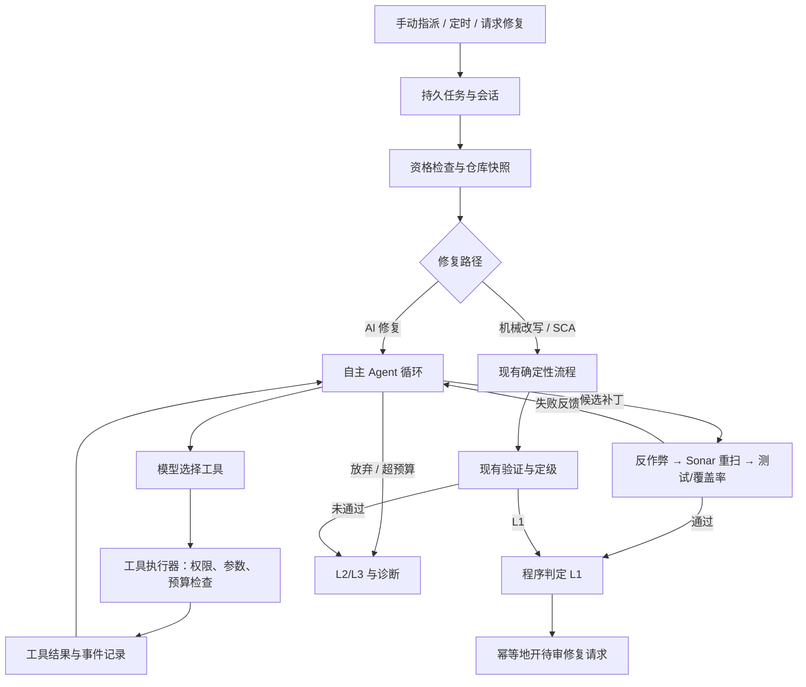

# ClearDebt 自主 Agent 实现方案

> 实现进度（2026-09-26）：受限工具、原生工具调用、多轮 LangGraph 检查点、多文件验证、补丁重放、ARQ 会话、活动事件及项目开关已接入。自主模式默认按项目关闭。真实 DeepSeek 联调发现 `auto` 可返回纯文本，已将工具选择默认改为 `required`，并在官方 Chat Completions 接口关闭默认思考模式；模型一次返回多个工具调用时，现按顺序逐个执行和记录检查点。真实告警验证已产生多轮工具事件；为避免无补丁地耗尽预算，已加入连续取证上限和 `report_blocker`。`test2` 的 `javascript:S3516` 已走通取证、补丁、Sonar 重扫和 GitLab 合并请求（!7）。推送曾因 SSL 中断而失败，git 的真实报错现在会写入会话说明。空跑评测仍待执行。当前只有全局环境变量预算；项目级预算与模型费用折算留作后续配置增强。

## 1. 目标与边界

把单条 Sonar 告警的 AI 修复改造成模型驱动的工具调用循环。模型可以自行搜索仓库、读取相关代码、选择修法、提交补丁，并依据测试或 Sonar 的反馈继续调查和修改，直到通过验证、确定无法修复或达到预算上限。

自主范围是**一条已获准处理的告警及其绑定仓库**。项目白名单、可修规则、仓库读写权限、质量闸门和开修复请求的条件仍由程序执行。模型不能自行扩大处理范围、宣布 L1、推送代码或合并请求。

首版沿用现有的手动指派、定时 backlog、请求修复三个入口。确定性机械改写和 SCA 升版本先保留现有流程；AI 修复进入新的自主循环。待该循环稳定后，再决定是否把机械改写失败和 SCA 异常也交给它诊断。

## 2. 当前实现与缺口

| 位置 | 当前行为 | 需要改造的点 |
| --- | --- | --- |
| `cleardebt/issue_graph.py` | `triage → fix → anti_cheat → rescan → test → decide` 固定流；失败后按模型阶梯重试 | 用自主循环替换 AI 的 `fix/retry_fix`，保留独立的验收闸门 |
| `cleardebt/b_fix.py` | 模型一次只返回一组 `old_string/new_string` | 增加原生工具调用协议和多文件补丁提交能力 |
| `cleardebt/evidence.py` | 调用模型前固定收集附近代码和少量符号信息 | 保留初始证据，同时允许模型按需扩展取证 |
| `cleardebt/issue_graph.py` 的 `anti_cheat`、`run_tests` | 检查主要围绕告警所在文件；非 Node 项目跳过测试 | 对所有改动文件检查；明确记录被跳过的测试闸 |
| `scripts/run_issue.py` | 按告警指纹读取 LangGraph checkpoint，完成后可直接复用 | 为每次尝试记录工具调用、补丁和仓库基线；避免新提交复用旧结果 |
| `cleardebt/api.py` | 手动指派和请求修复由进程内 daemon 线程启动 | 统一交给持久任务队列，以便重启恢复和取消 |
| `cleardebt/batch_worker.py` | 定时任务已使用 ARQ | 复用其任务执行设施，统一三种入口 |

现有 `scripts/open_merge_request.py` 已支持从过闸状态读取 `changed_files`，可继续作为开请求的唯一出口；需要确保该列表包含本轮**全部**已验证文件。

## 3. 目标架构



模型控制调查和改法，程序控制工具权限、验证结果与外部写入。Agent 循环只在隔离的工作目录运行；开请求时仍从已验证补丁重新生成提交。

## 4. 工具接口

使用模型供应商支持的原生 `tool_calls` 协议。新增一个模型适配层，统一消息、工具定义、调用 ID 和返回值；未提供可用工具调用能力的模型不能开启自主模式，并显示配置错误。旧 `propose_patch()` 保留给固定流程和回退。

首版工具如下。每个工具都返回结构化结果：`ok`、`data`、`error_code`、`summary`，大型输出按行数和字节数截断，并提示模型进一步缩小查询范围。

| 工具 | 输入 | 作用与约束 |
| --- | --- | --- |
| `search_repo` | 查询词、文件范围、结果上限 | 在当前工作目录搜索；默认忽略依赖、构建产物、二进制文件 |
| `read_file` | 相对路径、起止行 | 读取限定行数，路径必须留在绑定仓库内 |
| `find_references` | 符号、文件/语言范围 | 先用仓库搜索实现；已有语言服务可作为后续增强 |
| `get_issue_context` | 无 | 返回当前 Sonar 告警、规则说明、位置、初始证据与历史同规则 L1 示例 |
| `get_diff` | 无 | 返回本轮全部改动和统计 |
| `apply_patch` | 文件列表及各文件的精确编辑，附预期内容哈希 | 支持多文件原子应用；冲突时不留下半个补丁；禁止改动仓库外路径和受保护文件 |
| `run_checks` | 检查类型：`quick` 或 `full` | `quick` 做语法/静态检查及反作弊；`full` 调用现有 Sonar 重扫、测试和覆盖率闸 |

首版不提供任意 shell、任意网络请求、Git push 或托管平台写入工具。`run_checks` 只运行服务端为该项目配置的检查命令，继续在现有沙箱中执行。工具执行器要处理 `..`、绝对路径、符号链接、超大文件、超时和敏感信息脱敏。

`apply_patch` 可先采用“文件路径 + 多个唯一原文替换”的结构，避免直接执行模型生成的 shell 或 patch 命令。每次编辑检查预期哈希与原文唯一性；之后若复杂补丁确有需求，再增加受控的 unified diff 格式。

## 5. 多轮循环与状态

实现采用 LangGraph 的 `agent_model` 与 `agent_tool` 两个循环节点，每轮各自写入 checkpoint。模型每轮只决定下一步；工具结果和验证反馈进入下一轮上下文。程序负责强制停止条件。

```text
加载告警、仓库基线和上次 checkpoint
while 未结束且预算未耗尽:
    将目标、可用工具、近期观察和剩余预算交给模型
    模型每轮返回一个或多个 tool_call；同轮按顺序逐个执行并记录结果
    校验参数与权限，执行并记录结果
    若提交了补丁：保存候选版本；模型可调用 quick 检查
    若模型请求 full 检查：执行现有硬闸，返回具体失败反馈
    若 full 全部满足开请求条件：程序结束循环并判定 L1
预算耗尽或模型未返回工具调用：程序保留诊断并判定 L3
```

初始预算是每条告警最多 **20 次工具调用、3 个候选补丁、2 次完整 Sonar 重扫、15 分钟**，并限制模型报告的 token 累计量。首版预算用环境变量调整，项目级预算和准确费用核算另行扩展。超时、无进展重复调用和连续相同补丁也触发停止，不能只靠模型自觉结束。

失败反馈应保留可行动信息：模型输出格式错误、补丁冲突、反作弊拦截、原告警未消失、新告警、测试失败、覆盖率不足、扫描基础设施故障分别编码。首版完整检查的基础设施故障不消耗 Sonar 检查预算，连续两次后停止；自动进入待重试任务状态留作后续增强。模型能看到精简的失败摘要，避免把扫描器故障误当成代码问题。

Agent 的持久状态至少包含：`session_id`、告警标识、仓库与目标分支、基线 commit SHA、运行版本、循环序号、预算余量、近期消息、工具调用及结果、候选补丁、验证结果、最终等级和原因。首版依靠 LangGraph checkpoint 恢复流程、补丁收据恢复文件，并用 `tool_call_id + 参数哈希` 防止重复执行写操作；活动事件在工具执行后写入，记录摘要和补丁哈希。工作目录丢失时，从基线重新检出并重放已确认的补丁。

## 6. 验证与开请求规则

1. 每个候选补丁都对**全部改动文件**运行路径检查、防作弊和 diff 检查。测试文件、抑制注释和掏空函数的现有限制继续执行。
2. `full` 检查复用现有临时 Sonar 项目重扫；目标告警必须消失，不能引入新告警。测试和覆盖率检查按项目能力运行。模型看到检查结果，但无权改写判定。
3. 最终 L1 只由程序根据本轮候选补丁的完整过闸记录给出。开请求前核对基线 SHA、补丁哈希、目标分支和 `changed_files`，确保提交内容与过闸内容一致。
4. 现有非 Node 项目可能跳过测试并得到 L1。自主模式沿用该闸门，检查结果和请求描述标记“测试已跳过”；项目级策略留作后续增强。
5. 开请求沿用现有白名单、空跑、每日额度、重复请求检查和人工合并规则。自主循环本身不直接调用托管平台写接口。

## 7. 任务、会话与界面

手动指派和请求修复提交到 ARQ；定时任务沿用现有 ARQ cron。首版会话状态为 `pending/running/completed/failed/cancelled`，按项目、入口和所选告警集合去重活跃任务；单告警 checkpoint 身份另含目标 ref 和基线 SHA。同一服务主机上的进程用告警指纹文件锁串行执行与开请求。任务开始时重新核对项目开关与绑定权限。多主机部署应改用数据库或分布式锁。

增加追加式 `agent_events`：时间、工具名、结果摘要、失败码和补丁哈希。活动页按时间展示工具调用和验证结果；耗时、参数摘要、检查 ID 与跨任务费用统计留作后续增强。原始密钥、完整认证头和可能包含密钥的完整 prompt 不写入事件或普通日志；当前 `b_fix.py` 的 prompt 日志方式不能直接照搬到自主循环。

会话提供取消入口。取消只停止后续工具调用，保留已记录的诊断，不开请求。服务重启后，运行中的任务由队列和 checkpoint 接管，避免单靠 API 进程中的 daemon 线程。

## 8. 分阶段交付

### 阶段 A：工具与执行底座

- 建 `cleardebt/agent_tools.py`：工具 schema、执行器、路径与预算校验、结构化结果。
- 建 `cleardebt/agent_model.py`：原生工具调用适配；校验未知工具、参数和重复调用 ID。
- 建 `cleardebt/agent_events.py`：事件表、候选补丁记录、敏感信息处理。
- 用模拟模型验证搜索、读文件、多文件补丁、工具拒绝和崩溃恢复；此阶段不开启真实修复请求。

### 阶段 B：自主循环接入

- 在 `cleardebt/issue_graph.py` 增加 `agent_model` / `agent_tool` 循环节点，复用现有图和 checkpoint。
- 将验证结果转成模型可消费的反馈；把反作弊、覆盖率和 `changed_files` 扩到全部改动文件。
- 在 `scripts/run_issue.py` 中引入基线 SHA 与运行版本，处理旧 checkpoint 的兼容与迁移，并保持固定流程可回退。
- 对同一告警验证“先搜索再改”“第一次补丁失败后根据反馈重改”“超预算停机”。

### 阶段 C：持久任务与放量

- 将 `cleardebt/api.py` 的手动和请求修复 daemon 线程改为 ARQ 任务；定时入口也调用同一执行器。
- 活动页展示事件流、预算、候选补丁和检查结果；增加按项目的自主模式开关，默认关闭。
- 先在 JS/TS 的空跑项目和仓库已有的 OSS 冻结评测集上比较固定流程与自主流程，再逐项目打开。

## 9. 验收标准

- 模型能自主连续调用至少两种取证工具，并基于返回内容选择改动位置；无需预先写死工具顺序。
- 首个补丁被 Sonar 或测试拒绝后，模型能看到具体反馈，提交不同的第二个补丁；只重复相同补丁会被停止。
- 多文件改动的每个文件都进入反作弊、验证记录和最终请求；任一硬闸失败均不得开请求。
- 未授权路径、任意命令、超预算调用被工具执行器拒绝；模型输出“已修好”不能改变等级。
- 工人重启后任务可恢复或明确失败，且不会重复提交补丁或重复开请求。
- 固定流程与自主流程在同一批告警上留下可比较的 L1/L2/L3、模型费用、工具次数、Sonar 次数和耗时数据；上线评审以真实差异和失败样例为依据。

## 10. 首版不做的事

首版只实现单 Agent、单告警内的自主工具调用。跨告警规划、自动修改项目配置、自动合并请求和通用终端工具不在范围内。先把可审计、可恢复、受预算约束的多轮修复跑稳，再考虑扩大自主范围。
